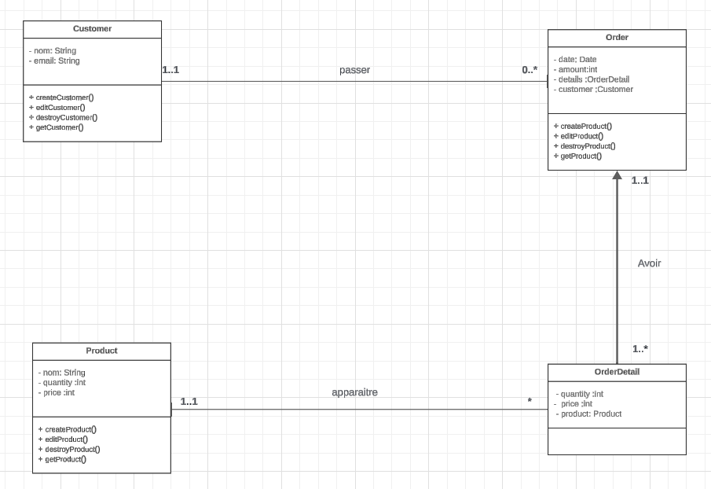

# Gestion projet

## Description
Ce projet est une application de gestion de commande implémentée en JavaScript, permettant la gestion des commanded, des clients, des produits  et les details commandes Le projet est divisé en plusieurs composants métiers, chacun étant responsable de la gestion des différentes entités impliquées dans le processus de gestion de commande.

## Prérequis

Avant de commencer, assurez-vous d'avoir installé les éléments suivants :
 - [Node.js]
 - [npm]

## Installation

Suivez ces étapes pour configurer le projet sur votre machine locale :

1. **Clonez le repository :**

    ```bash
    git clone https://github.com/Zoubeir7/gestion-commande.git
    ```

2. **Installez les dépendances :**

    ```bash
    npm install
    ```

3. **Lancez le serveur Express.js :**

    ```bash
    npm start
    ```


## Diagramme de classe



## Auteur

[Zoubeir Ba](https://github.com/Zoubeir7)
